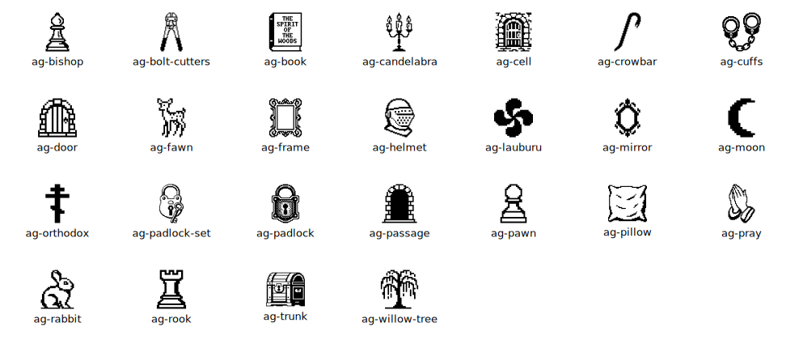

# Analog Gothic

Analog Gothic is a free, open-source 1-bit pixel icon kit inspired by medieval symbolism and nature. 🗝️

## Kit



## Usage

All icons in this kit are pure SVGs, allowing flexibility across a wide range of use cases:
- Standalone icons using ``
- SVG sprite references
- Inline SVG (copy-paste directly into markup)

Standalone icon:
```html

```

SVG sprite:
```html
<div id="ag-sprite" style="display:none">
    <!-- Replace with analog-gothic.svg sprite contents here -->
</div>
<svg class="ag-icon ag-icon-book" width="48" height="48" aria-hidden="true">
  <use href="#ag-book" />
</svg>
```

Inline SVG:
```html
<!-- Inline SVG usage -->
<svg class="ag-icon ag-icon-book" viewBox="0 0 1024 1024" aria-hidden="true">
  ...
</svg>
```

## Releases

Analog Gothic is maintained under [semantic versioning guidelines](https://semver.org).

What to expect when making use of this icon kit:
* A `major` release may add, remove, modify, or rename icons
* A `minor` release will be reserved for general improvements and may add icons
* A `patch` release will be reserved for bug fixes
