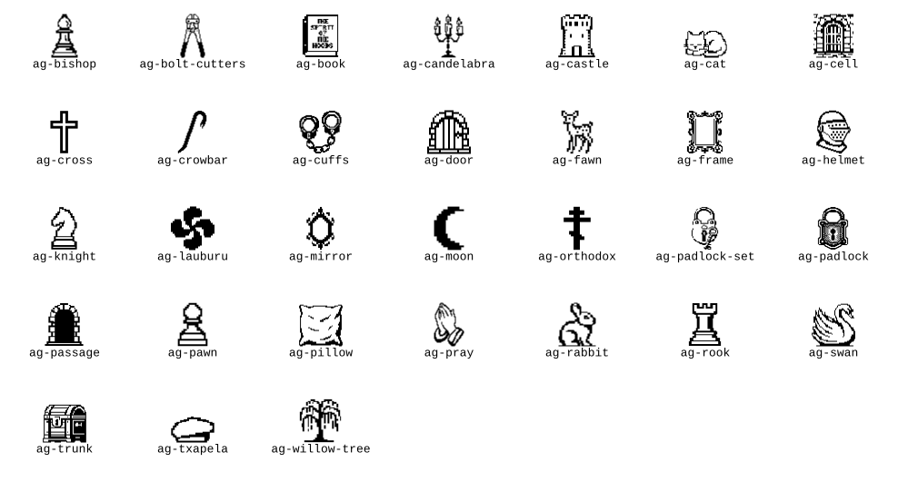

# Analog Gothic [](https://github.com/hastefuI/analog-gothic/actions/workflows/ci.yml) [](https://github.com/hastefuI/analog-gothic/releases) [](https://github.com/hastefuI/analog-gothic/blob/main/LICENSE)

Analog Gothic is a free, open-source 1-bit pixel icon kit inspired by medieval symbolism and nature. 🗝️

## Kit



## Overview

This icon kit embraces intentional simplicity, combining both filled and outlined pixel icons within the same set.

All icons in this kit are pure SVGs, allowing flexibility across a wide range of use cases:
- Standalone icons using ``
- SVG sprite references
- Inline SVG (copy-paste directly into markup)

## Usage

Standalone icon:
```html

```

SVG sprite:
```html
<div id="ag-sprite" style="display:none">
    <!-- Replace with analog-gothic.svg sprite contents here -->
</div>
<svg class="ag-icon ag-icon-book" width="48" height="48" aria-hidden="true">
  <use href="#ag-book" />
</svg>
```

Inline SVG:
```html
<!-- Inline SVG usage -->
<svg class="ag-icon ag-icon-book" fill="currentColor" viewBox="0 0 1024 1024" aria-hidden="true">
  ...
</svg>
```

## Development

Requires Node.js 24+ and `make`. Run `make` to list every target.

```sh
make install     # install dependencies from the lockfile
make add         # normalize + optimize stage/*.svg into icons/
make artifacts   # regenerate analog-gothic.svg and analog-gothic-kit.svg
make verify      # fail if the committed artifacts are stale
make preview     # build dist/ and open it in a browser
```

No Node.js on your machine? Every target has a Docker equivalent:

```sh
make docker-image    # build the image once
make docker-build    # optimize icons/ and regenerate artifacts
make docker-verify   # confirm the committed artifacts are in sync
make docker-preview  # live-reload preview on http://localhost:3000
```

See [CONTRIBUTING.md](./CONTRIBUTING.md) for the full icon workflow and
release process.

## Releases

Analog Gothic is maintained under [semantic versioning guidelines](https://semver.org).

What to expect when making use of this icon kit:
* A `major` release may add, remove, modify, or rename icons
* A `minor` release will be reserved for general improvements and may add icons
* A `patch` release will be reserved for bug fixes

## License

Licensed under [MIT License](https://opensource.org/licenses/MIT), see [LICENSE](./LICENSE) for details.

Copyright (c) 2026 hasteful.
